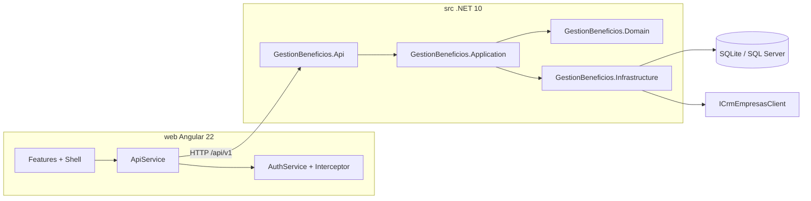
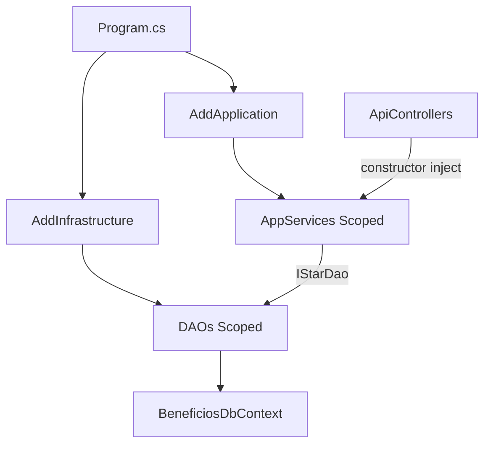
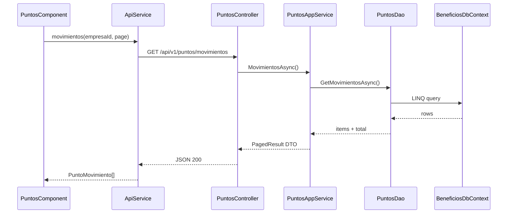

# Arquitectura — Sistema de Gestión de Beneficios ADEX

Documento de referencia técnica del monorepo **gestion-beneficios-adex**: organización de carpetas, capas backend, inyección de dependencias, acceso a datos y frontend Angular.

**Stack:** Angular 22 · .NET 10 · EF Core · SQLite (dev) / SQL Server (prod)

---

## 1. Visión general

El sistema gestiona beneficios para empresas asociadas a ADEX: sincronización de empresas desde CRM, alumnos, contrataciones, generación de puntos, canje de beneficios, cargas masivas, comunicaciones y auditoría.

El repositorio es un **monorepo** con backend y frontend **independientes** que se comunican por REST JSON:

| Componente | Ubicación | URL local |
|------------|-----------|-----------|
| API REST | `src/GestionBeneficios.Api` | http://localhost:5280 |
| SPA Angular | `web/` | http://localhost:4200 |
| Contrato API | `/api/v1/*` | JWT Bearer |



### Estructura del repositorio

```
gestion-beneficios-adex/
├── src/                              # Backend .NET (4 proyectos)
│   ├── GestionBeneficios.Api         # Host HTTP, controllers, middleware
│   ├── GestionBeneficios.Application # Casos de uso, DTOs, interfaces
│   ├── GestionBeneficios.Domain      # Entidades, enums, reglas de dominio
│   └── GestionBeneficios.Infrastructure  # EF Core, DAOs, stubs, jobs
├── tests/                            # Tests unitarios (Domain, Application)
├── web/                              # Frontend Angular 22 + Material
│   └── src/app/
│       ├── core/                     # Auth, API, guards, shell, modelos
│       ├── features/                 # Pantallas por dominio
│       └── shared/                   # Componentes reutilizables
├── docs/                             # Documentación
├── postman/                          # Colección Postman
└── README.md
```

---

## 2. Backend — Clean Architecture

El backend sigue **Clean Architecture** con cuatro capas y reglas de dependencia estrictas:

```
Api  →  Application, Infrastructure
Infrastructure  →  Application, Domain
Application  →  Domain
Domain  →  (sin dependencias externas)
```

### 2.1 Capa de presentación — `GestionBeneficios.Api`

Responsabilidad: exponer HTTP, autenticación, CORS, pipeline de middleware.

| Archivo | Rol |
|---------|-----|
| `Program.cs` | Bootstrap: controllers, JWT, CORS, `AddApplication()`, `AddInfrastructure()`, seed |
| `Controllers/ApiControllers.cs` | Todos los controllers REST (un solo archivo) |
| `ExceptionMiddleware.cs` | Excepciones globales → JSON |
| `appsettings.json` | SQLite, JWT dev, CORS, intervalo de jobs |
| `appsettings.SqlServer.json` | Perfil SQL Server |

**Pipeline HTTP:**

```
ExceptionMiddleware → CORS ("spa") → Authentication → Authorization → Controllers
```

### 2.2 Capa de aplicación — `GestionBeneficios.Application`

Responsabilidad: orquestar casos de uso, mapear entidades ↔ DTOs, definir contratos (interfaces).

| Carpeta / archivo | Contenido |
|-------------------|-----------|
| `Abstractions/Abstractions.cs` | Interfaces: `I*Dao`, `IUnitOfWork`, `ICrmEmpresasClient`, `IEmailSender`, `ICurrentUser` |
| `DTOs/Dtos.cs` | Records de request/response, `PagedResult<T>` |
| `Services/CoreServices.cs` | `EmpresaAppService`, `AlumnoAppService`, `ContratacionAppService` |
| `Services/CanjeBeneficioServices.cs` | `BeneficioAppService`, `CanjeAppService`, `PuntosAppService`, `DashboardAppService` |
| `Services/CargaComunicacionServices.cs` | `CargaMasivaAppService`, `ComunicacionAppService`, `AuditoriaAppService`, `AddApplication()` |

Los **App Services** son clases concretas (sin interfaz propia) inyectadas directamente en los controllers.

### 2.3 Capa de dominio — `GestionBeneficios.Domain`

Responsabilidad: entidades, enums y reglas de negocio puras (sin EF, HTTP ni DI).

| Archivo | Contenido |
|---------|-----------|
| `Entities/Entities.cs` | `EmpresaAsociada`, `Alumno`, `Contratacion`, `PuntoLote`, `PuntoMovimiento`, `Beneficio`, `Canje`, `PlantillaCorreo`, `CorreoEnviado`, `CargaMasiva`, `AuditoriaEvento`, etc. |
| `Enums/DomainEnums.cs` | `EstadoContratacion`, `TipoPuntoMovimiento`, `EstadoCanje`, `EstadoCorreo`, `EstadoCargaMasiva` |
| `Services/PuntosCalculator.cs` | Cálculo de puntos: sueldo × meses completos de 30 días calendario |

### 2.4 Capa de infraestructura — `GestionBeneficios.Infrastructure`

Responsabilidad: persistencia EF Core, implementación de DAOs, integraciones externas (stubs), jobs en background, seed inicial.

| Archivo | Contenido |
|---------|-----------|
| `DependencyInjection.cs` | `AddInfrastructure()`, `SeedAsync()`, `LoggingEmailSender`, `HttpCurrentUser`, `VencimientoBackgroundService` |
| `Persistence/BeneficiosDbContext.cs` | DbContext EF, mapeo fluent de tablas |
| `Persistence/Daos.cs` | Implementaciones `*Dao` + `EfUnitOfWork` |
| `Crm/MockCrmEmpresasClient.cs` | Stub del CRM de Empresas (desarrollo) |
| `Crm/CrmEmpresasHttpClient.cs` | Cliente HTTP API ADEX (producción) |

---

## 3. Inyección de dependencias (DI)

El registro de servicios ocurre en **tres puntos**, encadenados desde `Program.cs`:

```csharp
builder.Services.AddApplication();           // Capa Application
builder.Services.AddInfrastructure(config);  // Capa Infrastructure
await app.Services.SeedAsync();              // Datos iniciales
```



### 3.1 Application — `AddApplication()`

Ubicación: `Application/Services/CargaComunicacionServices.cs`

Todos los App Services se registran como **Scoped**:

| App Service | Dominio |
|-------------|---------|
| `EmpresaAppService` | Empresas, sync CRM |
| `AlumnoAppService` | Alumnos |
| `ContratacionAppService` | Contrataciones, generación de puntos |
| `BeneficioAppService` | Catálogo de beneficios |
| `CanjeAppService` | Canjes |
| `PuntosAppService` | Ledger, vencimientos |
| `DashboardAppService` | KPIs y overview |
| `CargaMasivaAppService` | Cargas Excel |
| `ComunicacionAppService` | Plantillas y correos |
| `AuditoriaAppService` | Auditoría |

### 3.2 Infrastructure — `AddInfrastructure()`

Ubicación: `Infrastructure/DependencyInjection.cs`

| Implementación | Interfaz | Lifetime |
|----------------|----------|----------|
| `BeneficiosDbContext` | — | Scoped (EF default) |
| `EfUnitOfWork` | `IUnitOfWork` | Scoped |
| `EmpresaDao` | `IEmpresaDao` | Scoped |
| `AlumnoDao` | `IAlumnoDao` | Scoped |
| `ContratacionDao` | `IContratacionDao` | Scoped |
| `PuntosDao` | `IPuntosDao` | Scoped |
| `BeneficioDao` | `IBeneficioDao` | Scoped |
| `CanjeDao` | `ICanjeDao` | Scoped |
| `PlantillaCorreoDao` | `IPlantillaCorreoDao` | Scoped |
| `CorreoDao` | `ICorreoDao` | Scoped |
| `CargaMasivaDao` | `ICargaMasivaDao` | Scoped |
| `AuditoriaDao` | `IAuditoriaDao` | Scoped |
| `ConfiguracionDao` | `IConfiguracionDao` | Scoped |
| `MockCrmEmpresasClient` / `CrmEmpresasHttpClient` | `ICrmEmpresasClient` | **Singleton** / **HttpClient** |
| `LoggingEmailSender` | `IEmailSender` | **Singleton** |
| `HttpCurrentUser` | `ICurrentUser` | Scoped |
| `VencimientoBackgroundService` | — | **HostedService** |

**DbContext:** SQLite por defecto; SQL Server si `Database:Provider = "SqlServer"`.

### 3.3 Api — `Program.cs`

- **JWT Bearer** (`Authentication:DevJwt:Key/Issuer/Audience`)
- **CORS** policy `"spa"` → orígenes en `Cors:Origins` (default `http://localhost:4200`)
- Controllers sin registro explícito (convención ASP.NET Core)

---

## 4. Acceso a datos (queries)

**No existe SQL crudo, Dapper ni carpeta `Queries/` separada.** Todo el acceso a datos usa **Entity Framework Core** con consultas **LINQ** en la capa Infrastructure.

### 4.1 Ubicación

| Qué | Dónde |
|-----|-------|
| Contratos (interfaces) | `Application/Abstractions/Abstractions.cs` |
| Implementaciones DAO | `Infrastructure/Persistence/Daos.cs` |
| DbContext y mapeo | `Infrastructure/Persistence/BeneficiosDbContext.cs` |
| Persistencia | `IUnitOfWork.SaveChangesAsync()` → `DbContext.SaveChangesAsync()` |

### 4.2 DAOs implementados

| DAO | Entidades / operaciones principales |
|-----|-------------------------------------|
| `EmpresaDao` | `EmpresaAsociada` — búsqueda paginada, upsert, por RUC/CRM |
| `AlumnoDao` | `Alumno` — CRUD, búsqueda por código |
| `ContratacionDao` | `Contratacion` — CRUD, detección de solape de fechas |
| `PuntosDao` | `PuntoMovimiento`, `PuntoLote` — movimientos, saldo, resumen, vencimientos |
| `BeneficioDao` | `Beneficio` — listado, CRUD |
| `CanjeDao` | `Canje` — listado, idempotencia |
| `PlantillaCorreoDao` | `PlantillaCorreo` |
| `CorreoDao` | `CorreoEnviado` — cola de envío |
| `CargaMasivaDao` | `CargaMasiva`, `CargaMasivaDetalle` |
| `AuditoriaDao` | `AuditoriaEvento` |
| `ConfiguracionDao` | `ConfiguracionSistema` — clave/valor |

### 4.3 Patrón de consulta típico

```csharp
// Ejemplo simplificado — PuntosDao.GetMovimientosAsync
var query = db.PuntoMovimientos.AsQueryable();
if (empresaId.HasValue)
    query = query.Where(m => m.EmpresaId == empresaId);
var total = await query.CountAsync(ct);
var items = await query
    .OrderByDescending(m => m.FechaMovimientoUtc)
    .Skip((page - 1) * pageSize)
    .Take(pageSize)
    .ToListAsync(ct);
```

### 4.4 Base de datos

| Aspecto | Detalle |
|---------|---------|
| ORM | Entity Framework Core 10 |
| Dev | SQLite (`gestion-beneficios.db`) |
| Prod | SQL Server (`appsettings.SqlServer.json`) |
| Migraciones | No — schema vía `EnsureCreatedAsync()` en `SeedAsync()` |
| Seed | Plantillas de correo, beneficios de ejemplo, sync CRM inicial |
| Job | `VencimientoBackgroundService` cada `Jobs:IntervalMinutes` (default 15 min) |

**Tablas principales:** EmpresaAsociada, Alumno, Contratacion, PuntoLote, PuntoMovimiento, Beneficio, Canje, PlantillaCorreo, CorreoEnviado, CargaMasiva, CargaMasivaDetalle, Auditoria, ConfiguracionSistema.

Ver **[MODELO-DATOS.md](MODELO-DATOS.md)** para el diagrama ERD, diccionario de campos, enumeraciones y flujo del ledger de puntos.

---

## 5. Flujo request típico

### Ejemplo: consultar ledger de puntos



**Cadena completa:**

```
Controller → AppService → I*Dao → BeneficiosDbContext → SQLite/SQL Server
```

Los controllers **no acceden al DbContext** directamente; siempre pasan por App Service → DAO.

---

## 6. API REST — endpoints

Todos los controllers están en `ApiControllers.cs`. Base: `api/v1/`. Autenticación JWT excepto auth y health.

| Controller | Ruta | Endpoints principales | Roles típicos |
|------------|------|----------------------|---------------|
| `AuthDevController` | `api/v1/auth` | `POST dev-token` [AllowAnonymous] | — |
| `HealthController` | `api/health` | `GET /` [AllowAnonymous] | — |
| `EmpresasController` | `api/v1/empresas` | GET, GET/{id}, sync/* | Admin, Operador |
| `AlumnosController` | `api/v1/alumnos` | GET, POST, PUT/{id} | Admin, Operador |
| `ContratacionesController` | `api/v1/contrataciones` | GET, GET/{id}, POST, PUT/{id} | Admin, Operador |
| `PuntosController` | `api/v1/puntos` | GET resumen/{id}, GET movimientos, POST procesar-vencimientos | Admin |
| `BeneficiosController` | `api/v1/beneficios` | GET, POST, PUT/{id} | GestionBeneficios, Admin |
| `CanjesController` | `api/v1/canjes` | GET, POST | Admin, Operador |
| `CargasMasivasController` | `api/v1/cargas-masivas` | plantilla, POST, GET/{id}, confirmar, errores | Admin, Operador |
| `PlantillasController` | `api/v1/plantillas-correo` | GET, POST, PUT/{id} | Admin |
| `CorreosController` | `api/v1/correos-enviados` | GET | Admin |
| `AuditoriaController` | `api/v1/auditoria` | GET | Admin |
| `DashboardController` | `api/v1/dashboard` | GET kpis, GET overview | Todos autenticados |

---

## 7. Frontend — Angular 22

### 7.1 Estructura `web/src/app/`

```
app/
├── app.ts, app.config.ts, app.routes.ts   # Bootstrap y rutas
├── core/                                   # Cross-cutting
│   ├── api.service.ts                      # Gateway HTTP único
│   ├── auth.service.ts                     # Login, token, roles (signals)
│   ├── auth.guard.ts, role.guard.ts        # Guards funcionales
│   ├── auth.interceptor.ts                 # Bearer + logout en 401
│   ├── shell.component.ts                  # Nav superior, drawer mobile
│   ├── adex-logo.component.ts              # Logo SVG inline
│   ├── app-role.ts                         # Roles, NAV_ITEMS, permisos
│   ├── models.ts                           # Interfaces TypeScript
│   └── notify.service.ts, http-error.ts    # UX y errores
├── features/                               # Pantallas por ruta
│   ├── login/
│   ├── dashboard/
│   ├── empresas/, empresa-detalle/
│   ├── alumnos/, contrataciones/
│   ├── puntos/, beneficios/, canjes/
│   ├── cargas/, comunicaciones/, auditoria/
│   └── forbidden/
└── shared/                                 # UI reutilizable
    ├── page-header, kpi-card, status-chip
    ├── loading-state, empty-state
    ├── dashboard-empresa-table, dashboard-distribucion
    └── role-if.directive.ts
```

### 7.2 Configuración y HTTP

| Archivo | Propósito |
|---------|-----------|
| `environments/environment.ts` | `apiBaseUrl: http://localhost:5280/api/v1` |
| `environments/environment.prod.ts` | `apiBaseUrl: /api/v1` (reverse proxy) |
| `proxy.conf.json` | Dev proxy `/api` → `:5280` |
| `app.config.ts` | `provideHttpClient(withInterceptors([authInterceptor]))`, zoneless |

**No hay NgRx ni store global.** Estado con **Angular signals** en componentes + `AuthService` signals + RxJS para HTTP.

### 7.3 Rutas y roles

| Ruta Angular | Componente | Roles |
|--------------|------------|-------|
| `/login` | LoginComponent | Público |
| `/dashboard` | DashboardComponent | Todos |
| `/empresas`, `/empresas/:id` | Empresas, EmpresaDetalle | Todos |
| `/alumnos` | AlumnosComponent | Todos |
| `/contrataciones` | ContratacionesComponent | Todos |
| `/puntos` | PuntosComponent | Todos |
| `/beneficios` | BeneficiosComponent | Todos |
| `/canjes` | CanjesComponent | Todos |
| `/cargas` | CargasComponent | Admin, Operador |
| `/comunicaciones` | ComunicacionesComponent | Admin |
| `/auditoria` | AuditoriaComponent | Admin |

Guards: `authGuard` (shell) + `roleGuard` (por ruta, lee `route.data.roles`).

### 7.4 Mapa pantalla ↔ API

| Pantalla | ApiService / endpoints |
|----------|------------------------|
| Login | `POST /auth/dev-token` |
| Dashboard | `GET /dashboard/kpis`, `GET /dashboard/overview` |
| Empresas | `GET/POST /empresas`, sync/* |
| Empresa detalle | `GET /empresas/{id}` |
| Alumnos | `GET/POST/PUT /alumnos` |
| Contrataciones | `GET/POST /contrataciones` |
| Puntos (ledger) | `GET /empresas`, `GET /puntos/resumen/{id}`, `GET /puntos/movimientos` |
| Beneficios | `GET/POST/PUT /beneficios` |
| Canjes | `GET/POST /canjes` |
| Cargas | `GET/POST /cargas-masivas/*` |
| Comunicaciones | `GET /plantillas-correo`, `GET /correos-enviados` |
| Auditoría | `GET /auditoria` |

### 7.5 Estilos ADEX

- `web/src/styles/_tokens.scss` — variables CSS (`--adex-blue`, spacing, layout)
- `web/src/styles/_theme.scss` — Material 3 + tokens ADEX
- `web/src/styles/_layout.scss`, `_components.scss` — utilidades globales

---

## 8. Autenticación y stubs (Fase 0)

| Integración | Implementación actual | Futuro |
|-------------|----------------------|--------|
| Auth | `POST /api/v1/auth/dev-token` — JWT HS256 24h | Login Centros Académico |
| CRM | `MockCrmEmpresasClient` / `CrmEmpresasHttpClient` (empresas); `MockCrmAlumnosClient` / `CrmAlumnosHttpClient` (alumnos) | API ADEX — ver [CRM-EMPRESAS.md](CRM-EMPRESAS.md), [CRM-ALUMNOS.md](CRM-ALUMNOS.md) |
| Email | `LoggingEmailSender` (log only) | SMTP / servicio institucional |

**Roles JWT:** `Administrador`, `Operador`, `Consulta`, `GestionBeneficios`.

Flujo auth frontend:

1. Login → `AuthService.login()` → POST dev-token
2. Token en `localStorage` (`gb_token`, `gb_role`, `gb_user`)
3. `authInterceptor` añade `Authorization: Bearer`
4. 401 → logout automático

Ver también: [FASE0-DECISIONES-STUB.md](FASE0-DECISIONES-STUB.md)

---

## 9. Tests

| Proyecto | Enfoque |
|----------|---------|
| `tests/GestionBeneficios.Domain.Tests` | `PuntosCalculator`, reglas de meses 30 días |
| `tests/GestionBeneficios.Application.Tests` | Lógica de aplicación |

```powershell
dotnet test
```

---

## 10. Referencias

| Documento | Contenido |
|-----------|-----------|
| [README.md](../README.md) | Instalación, comandos, requisitos |
| [FASE0-DECISIONES-STUB.md](FASE0-DECISIONES-STUB.md) | Decisiones stub auth/CRM/puntos |
| [DESPLIEGUE-Y-CARD.md](DESPLIEGUE-Y-CARD.md) | Despliegue institucional |
| [CARGA-MASIVA-EXCEL.md](CARGA-MASIVA-EXCEL.md) | Formato Excel cargas |
| [CRM-EMPRESAS.md](CRM-EMPRESAS.md) | Integración CRM de Empresas ADEX |
| [CRM-ALUMNOS.md](CRM-ALUMNOS.md) | Integración CRM de Alumnos ADEX |
| [postman/GestionBeneficios.postman_collection.json](../postman/GestionBeneficios.postman_collection.json) | Colección API |
| [ARQUITECTURA-Gestion-Beneficios-ADEX.docx](ARQUITECTURA-Gestion-Beneficios-ADEX.docx) | Versión Word de este documento |

---

*Última actualización: documento generado como referencia de arquitectura del repositorio gestion-beneficios-adex.*
