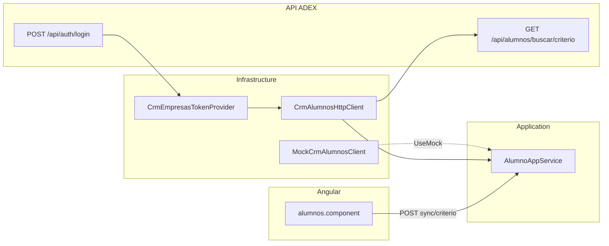

# CRM de Alumnos — consulta e integración

Documento de referencia para la sincronización on-demand de alumnos desde el CRM ADEX hacia la base local.

## 1. Propósito y alcance

- Los alumnos provienen del **CRM** (sincronización local). **Sin alta manual** en la pantalla Alumnos.
- Fuente externa: API ADEX en `https://sistemagestionventasapi.adexperu.edu.pe`.
- Correlación local: `Alumno.CrmAlumnoCodigo` (= `codAlumno`) + `Dni`.
- UI uniforme con Empresas: sync por periodo (preview/procesar), catálogo completo y Sync DNI/código.
- **Limitación API real:** solo existe `GET /api/alumnos/buscar/{criterio}`. Periodo y catálogo completo requieren listado; en producción HTTP fallan con mensaje claro. Con `UseMock: true` el mock sí soporta periodo/catálogo.

La carga masiva Excel puede seguir creando alumnos locales al confirmar contrataciones.



Ver también empresas: [CRM-EMPRESAS.md](CRM-EMPRESAS.md) (auth compartida).

---

## 2. API externa ADEX

### Autenticación

Misma que Empresas: `POST /api/auth/login` con `codUser` → JWT Bearer.  
Token cacheado en `CrmEmpresasTokenProvider` (sección `CrmEmpresas:CodUser`).

### Consulta de alumno

| Método | Ruta | Path param |
|--------|------|------------|
| GET | `/api/alumnos/buscar/{criterio}` | DNI (ej. `75373356`) o código (ej. `000349212`) |

- Respuesta **200**: objeto plano (no usa `iCodigo`/`datos`).
- Respuesta **404**: `{ "mensaje": "No se encontró ningún alumno..." }`.
- Roles en la API externa: Administrador, Supervisor (nuestra API interna usa Administrador/Operador).

### Campos de respuesta

| Campo CRM | Descripción |
|-----------|-------------|
| `codAlumno` | Código académico único |
| `primerNombre`, `segundoNombre` | Nombres |
| `apellido`, `apellidoPrefijo` | Apellidos |
| `dni` | Documento de identidad |
| `cicloActual` | Ciclo académico (entero) |
| `email` | Correo institucional |
| `emailPersonal` | Correo personal |
| `telefono` | Teléfono |
| `carrera` | Carrera |
| `modalidad` | Modalidad (ej. Presencial) |
| `fecNac` | Fecha de nacimiento |
| `denominacion` | Escuela / denominación |

**Limitación:** no hay listado paginado ni sync por periodo/catálogo completo.

---

## 3. Mapeo de campos

| Campo CRM | Campo local | Notas |
|-----------|-------------|-------|
| `codAlumno` | `CrmAlumnoCodigo`, `CodigoAlumno` | Clave de correlación |
| `dni` | `Dni` | En alta manual, DNI = `CodigoAlumno` |
| `primerNombre` + `segundoNombre` | `Nombres` | Concatenados |
| `apellido` + `apellidoPrefijo` | `Apellidos` | Concatenados |
| `cicloActual` | `Ciclo` | Como string |
| `email` | `Correo` | Institucional |
| `emailPersonal` | `EmailPersonal` | Readonly en UI |
| `telefono` | `Telefono` | |
| `carrera` | `Carrera` | |
| `modalidad` | `Modalidad` | Readonly |
| `fecNac` | `FechaNacimiento` | Readonly |
| `denominacion` | `Denominacion` | Readonly |
| — | `UltimaSyncUtc` | Timestamp de sync |

**Edición local** (`PUT`): solo nombres, apellidos, carrera, ciclo, teléfono, correo. Campos CRM no se editan desde la app.

---

## 4. Flujos de sincronización

### a) Sync por periodo (preview → procesar) — mock / si hay listado

1. `POST /api/v1/alumnos/sync/preview` — vista previa sin persistir.
2. `POST /api/v1/alumnos/sync/procesar` — upsert + guarda `AlumnoSync.UltimoInicio/Fin`.
3. `GET /api/v1/alumnos/sync/estado` — último corte y sugerencia (−10 min).

### b) Sync por DNI/código (CRM real y mock)

1. UI / Postman → `POST /api/v1/alumnos/sync/{criterio}`
2. `GET /api/alumnos/buscar/{criterio}` en CRM
3. Upsert + auditoría `SYNC_CRM_ALUMNO`

Criterios de prueba (mock): DNI `75373356`, código `000349212`.

### c) Sync catálogo completo — mock

- `POST /api/v1/alumnos/sync` — upsert masivo; auditoría `SYNC_CRM_ALUMNO_CATALOGO`.
- Con cliente HTTP real: error indicando que la API no expone listado.

---

## 5. Configuración

Sección `CrmAlumnos` en `appsettings.json`:

| Clave | Default | Descripción |
|-------|---------|-------------|
| `BaseUrl` | URL ADEX | Base del HttpClient |
| `UseMock` | `true` | Mock vs `CrmAlumnosHttpClient` |
| `RequestTimeoutSeconds` | `60` | Timeout HTTP (10–300) |

Credencial de auth: `CrmEmpresas:CodUser` (compartida).

### Producción

```
CrmAlumnos__UseMock=false
CrmEmpresas__CodUser=<codUser>
CrmEmpresas__UseMock=false
```

---

## 6. Modo mock

Con `CrmAlumnos:UseMock=true`:

- `MockCrmAlumnosClient` con 2 alumnos del documento de especificación.
- No requiere `CodUser` ni red externa.

---

## 7. UI Angular

Pantalla `/alumnos` (espejo de Empresas):

| Acción | Descripción |
|--------|-------------|
| Periodo (inicio/fin) | Preview → Procesar; "Usar último corte" |
| Catálogo completo | Confirmación; mock completo |
| Sync DNI/código | On-demand (funciona contra CRM real) |
| Editar | Solo alumnos ya sincronizados; sin botón Nuevo |

Roles sync: **Administrador**, **Operador**.

---

## 8. Endpoints internos

Base: `api/v1/alumnos`

| Método | Ruta | Rol | Descripción |
|--------|------|-----|-------------|
| GET | `/` | autenticado | Búsqueda paginada |
| GET | `/{id}` | autenticado | Detalle |
| POST | `/` | Admin, Operador | Alta (carga masiva / legacy; no expuesta en UI) |
| PUT | `/{id}` | Admin, Operador | Edición local |
| GET | `/sync/estado` | Admin, Operador | Estado sync periodo |
| POST | `/sync/preview` | Admin, Operador | Vista previa periodo |
| POST | `/sync/procesar` | Admin, Operador | Procesar periodo |
| POST | `/sync/{criterio}` | Admin, Operador | Sync CRM puntual |
| POST | `/sync` | Admin, Operador | Catálogo completo |

---

## 9. Troubleshooting

| Síntoma | Acción |
|---------|--------|
| `CodUser no está configurado` | Configurar `CrmEmpresas:CodUser` con `UseMock: false` |
| Alumno inexistente en CRM | Verificar DNI/código; mock: `75373356` |
| 401 en CRM | Renovación automática; revisar credencial |
| Sin sync por periodo | Esperado: la API externa no lista catálogo |

---

## 10. Referencias

| Componente | Archivo |
|------------|---------|
| Abstracción | `Abstractions.cs` → `ICrmAlumnosClient`, `CrmAlumnoDto` |
| Servicio | `CoreServices.cs` → `AlumnoAppService` |
| Cliente HTTP | `Crm/CrmAlumnosHttpClient.cs` |
| Mock | `Crm/MockCrmAlumnosClient.cs` |
| UI | `web/src/app/features/alumnos/alumnos.component.ts` |
| Empresas (auth) | [CRM-EMPRESAS.md](CRM-EMPRESAS.md) |
