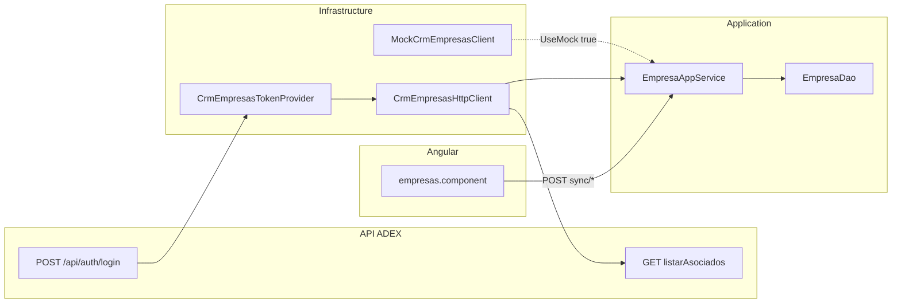

# CRM de Empresas — consulta e integración

Documento de referencia para la sincronización de empresas asociadas desde el CRM ADEX hacia la base local del sistema de Gestión de Beneficios.

## 1. Propósito y alcance

- Las empresas asociadas provienen **exclusivamente del CRM**; no hay alta manual en la aplicación.
- Fuente externa: API ADEX en `https://sistemagestionventasapi.adexperu.edu.pe`.
- Correlación local: `EmpresaAsociada.CrmEmpresaId` (único) + `Ruc`.
- La UI de Empresas (`/empresas`) expone tres formas de sincronización más consulta local paginada.



---

## 2. API externa ADEX

### Autenticación

| Método | Ruta | Body | Respuesta |
|--------|------|------|-----------|
| POST | `/api/auth/login` | `{ "codUser": "..." }` | `{ "token": "..." }` |

El token JWT se cachea en memoria (`CrmEmpresasTokenProvider`). Ante un **401** en consulta, se invalida y se renueva automáticamente (un reintento).

El mismo token autentica también el endpoint de alumnos (`GET /api/alumnos/buscar/{criterio}`). Ver [CRM-ALUMNOS.md](CRM-ALUMNOS.md).

### Consulta de asociados

| Método | Ruta | Query params |
|--------|------|--------------|
| GET | `/api/crm-on-premise/listarAsociados` | `page`, `pageSize`, `buscador?` |

- `buscador`: filtra por RUC (8–11 dígitos).
- Paginación: el cliente recorre todas las páginas hasta recibir un lote menor que `PageSize`.
- Respuesta esperada:

```json
{
  "iCodigo": 1,
  "sRespuesta": "OK",
  "datos": [ { "...": "..." } ]
}
```

Validación: `iCodigo` debe ser `1`. Cualquier otro valor lanza error con `sRespuesta`.

### Campos de respuesta (`datos[]`)

| Campo CRM | Descripción |
|-----------|-------------|
| `uIdCuenta` | Identificador único de cuenta en CRM |
| `sNumeroDocumento` | RUC |
| `sRazonSocial` | Razón social |
| `sCategoria` | Categoría / gremio |
| `sFechaAlta` | Fecha de alta (texto) |
| `sCentralTelefonica` | Teléfono |
| `sCorreo` | Correo electrónico |
| `sPaginaWeb` | Página web |
| `sEjecutivoComercial` | Ejecutivo comercial |
| `sPromotor` | Promotor |
| `sGerencia` | Gerencia |
| `sComite` | Comité |
| `sEstado` | Estado en CRM |
| `createdOn` | Fecha de creación del registro (ISO) |

### Limitación crítica

La API **no expone filtro por fecha**. El sync por periodo descarga el catálogo completo (paginado) y filtra localmente por `createdOn`.

| Estrategia | Cuándo usarla |
|------------|---------------|
| **Sync por periodo** | Detectar **altas nuevas** en un rango de fechas CRM |
| **Sync catálogo completo** | Actualizar empresas **ya existentes** (cambios de contacto, estado, etc.) |
| **Sync por RUC** | Consulta puntual de una empresa por `buscador` |

---

## 3. Mapeo de campos

CRM → `CrmEmpresaDto` → `EmpresaAsociada` (implementado en `CrmEmpresaMapper.cs`):

| Campo CRM | Campo local | Notas |
|-----------|-------------|-------|
| `uIdCuenta` | `CrmEmpresaId` | Si vacío, se genera un GUID |
| `sNumeroDocumento` | `Ruc` | Readonly en UI |
| `sRazonSocial` | `RazonSocial` | Editable localmente |
| `sCategoria` | `Categoria` | Editable localmente |
| `sEstado` | `EstadoCrm`, `Activo` | `Activo = false` si el estado contiene `inactiv`, `baja` o `cancel` |
| `createdOn` | `CrmCreatedOn` | Usado para sync por periodo |
| `sFechaAlta` | `FechaAltaCrm` | Readonly |
| `sCorreo` | `Correo` | Readonly |
| `sCentralTelefonica` | `Telefono` | Readonly |
| `sPaginaWeb` | `PaginaWeb` | Readonly |
| `sEjecutivoComercial` | `EjecutivoComercial` | Readonly |
| `sPromotor` | `Promotor` | Readonly |
| `sGerencia` | `Gerencia` | Readonly |
| `sComite` | `Comite` | Readonly |
| — | `UltimaSyncUtc` | Timestamp de última sincronización (UTC) |

**Edición local** (`PUT /api/v1/empresas/{id}`): solo `RazonSocial`, `Categoria` y `Activo`. RUC e ID CRM no se modifican desde la aplicación.

---

## 4. Flujos de sincronización

Implementados en `EmpresaAppService` (`CoreServices.cs`).

### a) Sync por periodo (preview → procesar)

1. **`POST /api/v1/empresas/sync/preview`** — body `{ "inicio": "...", "fin": "..." }`
   - Consulta CRM, filtra por `createdOn` en el rango.
   - Retorna lista con flag `yaExisteLocal` (match por `CrmEmpresaId` o `Ruc`).
   - **No persiste** cambios.

2. **`POST /api/v1/empresas/sync/procesar`** — mismo body
   - Upsert de todas las empresas del periodo.
   - Guarda `EmpresaSync.UltimoInicio` y `EmpresaSync.UltimoFin` en `ConfiguracionSistema`.
   - Auditoría: `SYNC_CRM_PERIODO`.

3. **`GET /api/v1/empresas/sync/estado`**
   - Retorna último periodo sincronizado y `siguienteInicioSugerido` (= `ultimoFin - 10 min`).
   - Overlap de 10 minutos evita perder registros en el límite del corte.

### b) Sync por RUC

- **`POST /api/v1/empresas/sync/{ruc}`**
- Llama a `listarAsociados?buscador={ruc}` (una página).
- Upsert de la empresa encontrada.
- Auditoría: `SYNC_CRM`.
- Error si el RUC no existe en CRM: `"Empresa inexistente en el CRM de Empresas."`

### c) Sync catálogo completo

- **`POST /api/v1/empresas/sync`**
- Descarga todas las páginas y hace upsert masivo.
- Auditoría: `SYNC_CRM_CATALOGO`.
- También se ejecuta en el **seed inicial** al arrancar la API (`SeedAsync` → `SyncCatalogAsync`).

### Reglas de upsert

1. Buscar empresa existente por `CrmEmpresaId`; si no existe, por `Ruc`.
2. Si no hay match, crear registro nuevo.
3. Campos provenientes del CRM **sobrescriben** los valores locales.
4. `UltimaSyncUtc` se actualiza a `DateTime.UtcNow`.

---

## 5. Configuración

Sección `CrmEmpresas` en `appsettings.json` (ver `CrmEmpresasOptions.cs`):

| Clave | Default | Descripción |
|-------|---------|-------------|
| `BaseUrl` | `https://sistemagestionventasapi.adexperu.edu.pe` | URL base del HttpClient |
| `CodUser` | `""` | Credencial de login CRM; **obligatorio** si `UseMock: false` |
| `PageSize` | `50` | Tamaño de página (rango 1–200) |
| `UseMock` | `true` | `true` → `MockCrmEmpresasClient`; `false` → `CrmEmpresasHttpClient` |
| `RequestTimeoutSeconds` | `60` | Timeout HTTP (rango 10–300) |

### Producción (variables de entorno)

```
CrmEmpresas__CodUser=<codUser>
CrmEmpresas__UseMock=false
CrmEmpresas__BaseUrl=https://sistemagestionventasapi.adexperu.edu.pe
CrmEmpresas__PageSize=50
```

Ver checklist en [DESPLIEGUE-Y-CARD.md](DESPLIEGUE-Y-CARD.md).

---

## 6. Modo mock (desarrollo)

Con `UseMock: true` (default en `appsettings.json` y `appsettings.Development.json`):

- Se usa `MockCrmEmpresasClient` con 5 empresas de ejemplo.
- No requiere `CodUser` ni conexión a la API ADEX.
- RUC de prueba: `20100070970` (ASOCIACIÓN DE EXPORTADORES).

---

## 7. UI Angular

Pantalla `/empresas` (`empresas.component.ts`):

| Acción | Descripción |
|--------|-------------|
| Periodo (inicio/fin) | Preview → Procesar; botón "Usar último corte" |
| Sync RUC | Campo de texto + botón; consulta on-demand |
| Catálogo completo | Botón con confirmación; puede tardar varios minutos |
| Búsqueda local | Tabla paginada sobre datos ya sincronizados |

Columnas de la tabla local y de la vista previa: RUC, razón social, categoría, teléfono, correo y promotor (los tres últimos provienen del CRM y se muestran como `—` si el CRM no los envía).

Roles requeridos para sync: **Administrador**, **Operador**.

Nota visible en UI: *"El periodo filtra por fecha de alta en CRM (createdOn). Para actualizar empresas existentes, use Sincronizar catálogo completo."*

Detalle de empresa (`empresa-detalle.component.ts`): bloque "Datos CRM" con correo, teléfono, promotor, estado CRM, alta CRM.

---

## 8. Endpoints internos

Base: `api/v1/empresas` — JWT requerido en todos.

| Método | Ruta | Rol | Body | Descripción |
|--------|------|-----|------|-------------|
| GET | `/` | Cualquier autenticado | — | Búsqueda paginada local |
| GET | `/{id}` | Cualquier autenticado | — | Detalle + resumen puntos |
| PUT | `/{id}` | Admin, Operador | `{ razonSocial, categoria, activo }` | Edición local |
| GET | `/sync/estado` | Admin, Operador | — | Estado del último sync |
| POST | `/sync/preview` | Admin, Operador | `{ inicio, fin }` | Vista previa periodo |
| POST | `/sync/procesar` | Admin, Operador | `{ inicio, fin }` | Procesar periodo |
| POST | `/sync/{ruc}` | Admin, Operador | — | Sync on-demand por RUC |
| POST | `/sync` | Admin, Operador | — | Catálogo completo |

Colección Postman: [GestionBeneficios.postman_collection.json](../postman/GestionBeneficios.postman_collection.json).

---

## 9. Troubleshooting

| Síntoma | Causa probable | Acción |
|---------|----------------|--------|
| `CrmEmpresas:CodUser no está configurado` | `UseMock: false` sin credencial | Configurar `CodUser` |
| 401 en consulta CRM | Token expirado | Reintento automático; verificar `CodUser` |
| `Empresa inexistente en el CRM` | RUC no encontrado | Verificar RUC en CRM o usar catálogo completo |
| Sync por periodo lento | Descarga catálogo completo + filtro local | Ejecutar off-peak; aumentar `PageSize` |
| Empresa existente sin cambios tras periodo | Periodo solo detecta altas (`createdOn`) | Usar sync catálogo completo |
| API no arranca con `UseMock: false` | `CodUser` vacío al validar DI | Configurar credencial o usar mock |

---

## 10. Referencias

### Código fuente

| Componente | Archivo |
|------------|---------|
| Abstracción | `src/GestionBeneficios.Application/Abstractions/Abstractions.cs` |
| Servicio sync | `src/GestionBeneficios.Application/Services/CoreServices.cs` |
| Controller | `src/GestionBeneficios.Api/Controllers/ApiControllers.cs` |
| Cliente HTTP | `src/GestionBeneficios.Infrastructure/Crm/CrmEmpresasHttpClient.cs` |
| Token provider | `src/GestionBeneficios.Infrastructure/Crm/CrmEmpresasTokenProvider.cs` |
| Mock | `src/GestionBeneficios.Infrastructure/Crm/MockCrmEmpresasClient.cs` |
| Mapper | `src/GestionBeneficios.Infrastructure/Crm/CrmEmpresaMapper.cs` |
| Modelos API | `src/GestionBeneficios.Infrastructure/Crm/CrmEmpresasApiModels.cs` |
| DI / seed | `src/GestionBeneficios.Infrastructure/DependencyInjection.cs` |
| UI | `web/src/app/features/empresas/empresas.component.ts` |
| API client | `web/src/app/core/api.service.ts` |

### Documentación relacionada

| Documento | Contenido |
|-----------|-----------|
| [ARQUITECTURA.md](ARQUITECTURA.md) | Capas, DI, diagrama general |
| [MODELO-DATOS.md](MODELO-DATOS.md) | Tabla `EmpresaAsociada`, ERD |
| [FASE0-DECISIONES-STUB.md](FASE0-DECISIONES-STUB.md) | Decisión stub vs producción |
| [DESPLIEGUE-Y-CARD.md](DESPLIEGUE-Y-CARD.md) | Checklist pre-producción |
| [CARGA-MASIVA-EXCEL.md](CARGA-MASIVA-EXCEL.md) | RUC debe existir en CRM/local |
| [CRM-ALUMNOS.md](CRM-ALUMNOS.md) | Sync on-demand de alumnos (mismo auth) |
