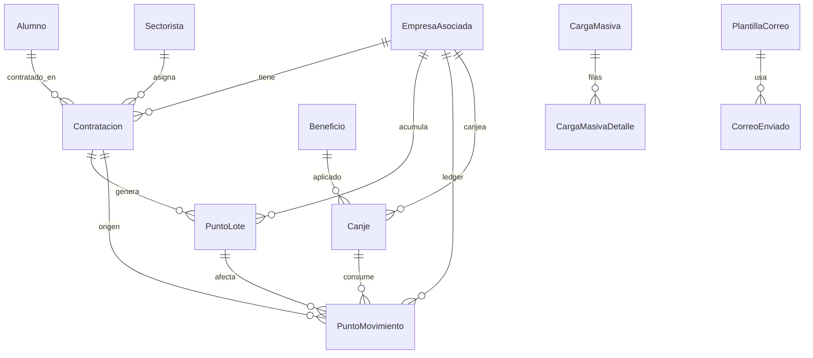
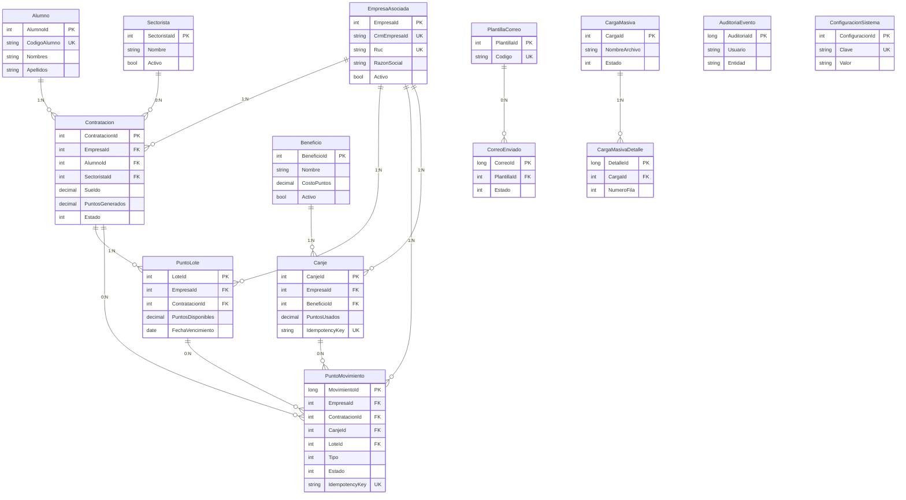
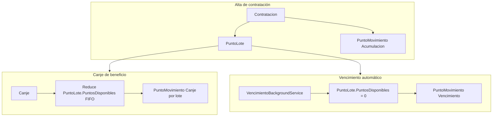

# Modelo de datos — Sistema de Gestión de Beneficios ADEX

Documento de referencia del **modelo de datos persistente** del monorepo **gestion-beneficios-adex**.

**Stack:** Entity Framework Core 10 · SQLite (desarrollo) · SQL Server (producción)

---

## 1. Introducción

### Propósito

Este documento describe las **14 tablas** del sistema, sus relaciones, índices, enumeraciones y las reglas de negocio que conectan el núcleo operativo (empresas, alumnos, contrataciones) con el **ledger de puntos** y los **canjes de beneficios**.

### Alcance

| Aspecto | Detalle |
|---------|---------|
| ORM | Entity Framework Core 10 |
| Entidades | `src/GestionBeneficios.Domain/Entities/Entities.cs` |
| Mapeo EF | `src/GestionBeneficios.Infrastructure/Persistence/BeneficiosDbContext.cs` |
| Dev | SQLite (`gestion-beneficios.db`) |
| Prod | SQL Server (`appsettings.SqlServer.json`) |
| Migraciones | **No** — el schema se crea con `EnsureCreatedAsync()` en `SeedAsync()` |
| Seed inicial | Plantillas de correo, beneficios de ejemplo, sync CRM |

### Nota sobre relaciones EF

Algunas tablas usan **FKs escalares** (`EmpresaId`, `ContratacionId`, `CanjeId`, `LoteId`) sin navegación configurada en `OnModelCreating` — en particular `PuntoLote` y `PuntoMovimiento`. El diagrama ERD refleja **relaciones lógicas** del dominio; las FKs explícitas en EF aparecen marcadas en el diccionario.

---

## 2. Diagrama entidad-relación

### 2.1 Vista general por dominios



### 2.2 Diagrama con atributos clave



### 2.3 Agrupación funcional

| Dominio | Tablas |
|---------|--------|
| Núcleo operativo | `EmpresaAsociada`, `Alumno`, `Sectorista`, `Contratacion` |
| Puntos | `PuntoLote`, `PuntoMovimiento` |
| Beneficios | `Beneficio`, `Canje` |
| Comunicaciones | `PlantillaCorreo`, `CorreoEnviado` |
| Carga masiva | `CargaMasiva`, `CargaMasivaDetalle` |
| Sistema | `Auditoria`, `ConfiguracionSistema` |

---

## 3. Diccionario de datos

Convenciones: **PK** = clave primaria · **UK** = índice único · **FK** = clave foránea · **NN** = not null · tipos .NET / SQL equivalentes.

### 3.1 EmpresaAsociada

Empresas asociadas a ADEX, sincronizadas desde CRM de Empresas (API ADEX).

| Columna | Tipo | NN | Default | Restricciones |
|---------|------|----|---------|---------------|
| `EmpresaId` | int | Sí | auto | **PK** |
| `CrmEmpresaId` | string(64) | Sí | `""` | **UK** |
| `Ruc` | string(20) | Sí | `""` | **UK** |
| `RazonSocial` | string(250) | Sí | `""` | Índice |
| `Categoria` | string | No | null | — |
| `Activo` | bool | Sí | `true` | — |
| `UltimaSyncUtc` | datetime | Sí | `UtcNow` | — |

**Relaciones:** 1:N → `Contratacion`, `PuntoMovimiento` (lógica), `Canje` (FK EF).

---

### 3.2 Alumno

Alumnos contratados por empresas asociadas. `CodigoAlumno` suele ser el DNI.

| Columna | Tipo | NN | Default | Restricciones |
|---------|------|----|---------|---------------|
| `AlumnoId` | int | Sí | auto | **PK** |
| `CodigoAlumno` | string(50) | Sí | `""` | **UK** |
| `Nombres` | string(120) | Sí | `""` | — |
| `Apellidos` | string(120) | Sí | `""` | — |
| `Carrera` | string | No | null | — |
| `Ciclo` | string | No | null | — |
| `Telefono` | string | No | null | — |
| `Correo` | string | No | null | — |
| `CreadoUtc` | datetime | Sí | `UtcNow` | — |

**Relaciones:** 1:N → `Contratacion` (FK EF).

---

### 3.3 Sectorista

Sectorista ADEX opcionalmente asignado a una contratación.

| Columna | Tipo | NN | Default | Restricciones |
|---------|------|----|---------|---------------|
| `SectoristaId` | int | Sí | auto | **PK** |
| `Nombre` | string | Sí | `""` | — |
| `Correo` | string | No | null | — |
| `Activo` | bool | Sí | `true` | — |

**Relaciones:** 0:N ← `Contratacion.SectoristaId` (FK EF, nullable).

---

### 3.4 Contratacion

Vínculo empresa–alumno con periodo, sueldo y puntos generados.

| Columna | Tipo | NN | Default | Restricciones |
|---------|------|----|---------|---------------|
| `ContratacionId` | int | Sí | auto | **PK** |
| `EmpresaId` | int | Sí | — | **FK** → `EmpresaAsociada` |
| `AlumnoId` | int | Sí | — | **FK** → `Alumno` |
| `SectoristaId` | int | No | null | **FK** → `Sectorista` |
| `Anio` | int | Sí | — | — |
| `Categoria` | string | No | null | — |
| `PerfilSolicitado` | string | No | null | — |
| `MesContratacion` | int | Sí | — | Meses estimados (días/30) |
| `FechaInicio` | date | Sí | — | Índice compuesto |
| `FechaFin` | date | Sí | — | Índice |
| `Sueldo` | decimal(18,2) | Sí | — | — |
| `Estado` | int (enum) | Sí | `Vigente` | Índice; ver §4 |
| `PuntosGenerados` | decimal(18,2) | Sí | — | — |
| `CreadoUtc` | datetime | Sí | `UtcNow` | — |
| `ActualizadoUtc` | datetime | No | null | — |

**Índices:** `(EmpresaId, FechaInicio)`, `(AlumnoId, FechaInicio)`, `Estado`, `FechaFin`.

**Relaciones:** N:1 → `EmpresaAsociada`, `Alumno`, `Sectorista?`; 1:N → `PuntoLote`, `PuntoMovimiento` (lógica).

---

### 3.5 PuntoLote

Saldo de puntos por contratación, con vencimiento. Se consume en canjes (FIFO por `FechaVencimiento`).

| Columna | Tipo | NN | Default | Restricciones |
|---------|------|----|---------|---------------|
| `LoteId` | int | Sí | auto | **PK** |
| `EmpresaId` | int | Sí | — | **FK lógica** → `EmpresaAsociada` |
| `ContratacionId` | int | Sí | — | **FK lógica** → `Contratacion` |
| `PuntosOriginales` | decimal(18,2) | Sí | — | — |
| `PuntosDisponibles` | decimal(18,2) | Sí | — | Saldo restante |
| `FechaVencimiento` | date | Sí | — | Índice `(EmpresaId, FechaVencimiento)` |
| `CreadoUtc` | datetime | Sí | `UtcNow` | — |

**Nota:** EF no declara `HasOne`/`WithMany` para esta entidad; las FKs son escalares.

---

### 3.6 PuntoMovimiento

Ledger inmutable de movimientos de puntos (acumulación, canje, vencimiento, ajuste).

| Columna | Tipo | NN | Default | Restricciones |
|---------|------|----|---------|---------------|
| `MovimientoId` | long | Sí | auto | **PK** |
| `EmpresaId` | int | Sí | — | **FK lógica** → `EmpresaAsociada` |
| `ContratacionId` | int | No | null | **FK lógica** → `Contratacion` |
| `CanjeId` | int | No | null | **FK lógica** → `Canje` |
| `LoteId` | int | No | null | **FK lógica** → `PuntoLote` |
| `Tipo` | int (enum) | Sí | — | Ver §4 |
| `Puntos` | decimal(18,2) | Sí | — | — |
| `FechaMovimientoUtc` | datetime | Sí | `UtcNow` | — |
| `FechaVencimiento` | date | No | null | — |
| `Estado` | int (enum) | Sí | `Disponible` | Ver §4 |
| `IdempotencyKey` | string(120) | Sí | `""` | **UK** |
| `Observacion` | string | No | null | — |

**Índices:** `IdempotencyKey` (único), `(EmpresaId, Estado, FechaVencimiento)`.

**Claves idempotencia típicas:**
- `ACUM-{ContratacionId}` — acumulación al crear contratación
- `CANJE-{CanjeId}-LOTE-{LoteId}` — consumo por canje
- `VENC-{LoteId}-{yyyyMMdd}` — vencimiento automático

---

### 3.7 Beneficio

Catálogo de beneficios canjeables por puntos.

| Columna | Tipo | NN | Default | Restricciones |
|---------|------|----|---------|---------------|
| `BeneficioId` | int | Sí | auto | **PK** |
| `Nombre` | string(200) | Sí | `""` | — |
| `Descripcion` | string | No | null | — |
| `Tipo` | string | No | null | — |
| `CostoPuntos` | decimal(18,2) | Sí | — | — |
| `Activo` | bool | Sí | `true` | — |

**Relaciones:** 1:N → `Canje` (FK EF).

---

### 3.8 Canje

Registro de canje de beneficio por una empresa; descuenta puntos de lotes disponibles.

| Columna | Tipo | NN | Default | Restricciones |
|---------|------|----|---------|---------------|
| `CanjeId` | int | Sí | auto | **PK** |
| `EmpresaId` | int | Sí | — | **FK** → `EmpresaAsociada` |
| `BeneficioId` | int | Sí | — | **FK** → `Beneficio` |
| `PuntosUsados` | decimal(18,2) | Sí | — | — |
| `Estado` | int (enum) | Sí | `Procesado` | Ver §4 |
| `FechaSolicitudUtc` | datetime | Sí | `UtcNow` | — |
| `FechaProcesoUtc` | datetime | No | null | — |
| `IdempotencyKey` | string(120) | Sí | `""` | **UK** |
| `SolicitadoPor` | string | No | null | Usuario JWT |

**Relaciones:** N:1 → `EmpresaAsociada`, `Beneficio`; 1:N → `PuntoMovimiento` (lógica).

---

### 3.9 PlantillaCorreo

Plantillas HTML para comunicaciones automáticas (puntos acumulados, canje confirmado, etc.).

| Columna | Tipo | NN | Default | Restricciones |
|---------|------|----|---------|---------------|
| `PlantillaId` | int | Sí | auto | **PK** |
| `Codigo` | string(80) | Sí | `""` | **UK** |
| `Asunto` | string | Sí | `""` | — |
| `CuerpoHtml` | string | Sí | `""` | — |
| `Variables` | string | No | null | JSON o lista de placeholders |
| `Activo` | bool | Sí | `true` | — |

---

### 3.10 CorreoEnviado

Cola/historial de correos encolados para envío.

| Columna | Tipo | NN | Default | Restricciones |
|---------|------|----|---------|---------------|
| `CorreoId` | long | Sí | auto | **PK** |
| `PlantillaId` | int | No | null | **FK lógica** → `PlantillaCorreo` |
| `Destinatario` | string | Sí | `""` | — |
| `Asunto` | string | Sí | `""` | — |
| `CuerpoHtml` | string | Sí | `""` | — |
| `Estado` | int (enum) | Sí | `Pendiente` | Índice; ver §4 |
| `Intentos` | int | Sí | `0` | — |
| `Error` | string | No | null | — |
| `CreadoUtc` | datetime | Sí | `UtcNow` | — |
| `EnviadoUtc` | datetime | No | null | — |

---

### 3.11 CargaMasiva

Cabecera de importación Excel de contrataciones.

| Columna | Tipo | NN | Default | Restricciones |
|---------|------|----|---------|---------------|
| `CargaId` | int | Sí | auto | **PK** |
| `NombreArchivo` | string | Sí | `""` | — |
| `Usuario` | string | Sí | `""` | — |
| `Estado` | int (enum) | Sí | `Validando` | Ver §4 |
| `TotalFilas` | int | Sí | `0` | — |
| `FilasValidas` | int | Sí | `0` | — |
| `FilasInvalidas` | int | Sí | `0` | — |
| `FilasProcesadas` | int | Sí | `0` | — |
| `CreadoUtc` | datetime | Sí | `UtcNow` | — |
| `CompletadoUtc` | datetime | No | null | — |

**Relaciones:** 1:N → `CargaMasivaDetalle` (FK EF).

---

### 3.12 CargaMasivaDetalle

Detalle fila a fila de una carga masiva (payload JSON + validación).

| Columna | Tipo | NN | Default | Restricciones |
|---------|------|----|---------|---------------|
| `DetalleId` | long | Sí | auto | **PK** |
| `CargaId` | int | Sí | — | **FK** → `CargaMasiva` |
| `NumeroFila` | int | Sí | — | — |
| `PayloadJson` | string | Sí | `"{}"` | Datos crudos de la fila |
| `EsValido` | bool | Sí | — | — |
| `Errores` | string | No | null | Mensajes concatenados |
| `Procesado` | bool | Sí | `false` | — |

---

### 3.13 Auditoria

Tabla física: **`Auditoria`**. Entidad: `AuditoriaEvento`.

| Columna | Tipo | NN | Default | Restricciones |
|---------|------|----|---------|---------------|
| `AuditoriaId` | long | Sí | auto | **PK** |
| `Usuario` | string | Sí | `""` | Nombre del JWT |
| `FechaUtc` | datetime | Sí | `UtcNow` | — |
| `Accion` | string | Sí | `""` | CREATE, UPDATE, CANJE, etc. |
| `Entidad` | string | Sí | `""` | Nombre de entidad |
| `EntidadId` | string | No | null | — |
| `ValorAnterior` | string | No | null | JSON serializado |
| `ValorNuevo` | string | No | null | JSON serializado |

**Índices:** `(Entidad, FechaUtc)`.

---

### 3.14 ConfiguracionSistema

Parámetros clave-valor del sistema (sync CRM, jobs, etc.).

| Columna | Tipo | NN | Default | Restricciones |
|---------|------|----|---------|---------------|
| `ConfiguracionId` | int | Sí | auto | **PK** |
| `Clave` | string | Sí | `""` | **UK** |
| `Valor` | string | Sí | `""` | — |
| `Descripcion` | string | No | null | — |

---

## 4. Enumeraciones

Definidas en `src/GestionBeneficios.Domain/Enums/DomainEnums.cs`. Se persisten como **int**.

### EstadoContratacion → `Contratacion.Estado`

| Valor | Nombre | Descripción |
|-------|--------|-------------|
| 1 | Vigente | Contratación activa |
| 2 | Vencida | Periodo finalizado |
| 3 | Anulada | Anulada manualmente |

### TipoPuntoMovimiento → `PuntoMovimiento.Tipo`

| Valor | Nombre | Descripción |
|-------|--------|-------------|
| 1 | Acumulacion | Puntos generados por contratación |
| 2 | Canje | Consumo por canje de beneficio |
| 3 | Vencimiento | Puntos vencidos (job automático) |
| 4 | Ajuste | Ajuste manual (reservado) |

### EstadoPuntoMovimiento → `PuntoMovimiento.Estado`

| Valor | Nombre | Descripción |
|-------|--------|-------------|
| 1 | Disponible | Puntos vigentes |
| 2 | Reservado | Reservados (flujo futuro) |
| 3 | Consumido | Usados en canje |
| 4 | Vencido | Expirados |

### EstadoCanje → `Canje.Estado`

| Valor | Nombre | Descripción |
|-------|--------|-------------|
| 1 | Procesado | Canje aplicado (default Fase 0) |
| 2 | Solicitado | Pendiente de aprobación |
| 3 | Aprobado | Aprobado |
| 4 | Rechazado | Rechazado |

### EstadoCorreo → `CorreoEnviado.Estado`

| Valor | Nombre | Descripción |
|-------|--------|-------------|
| 1 | Pendiente | En cola |
| 2 | Enviado | Enviado correctamente |
| 3 | Error | Falló el envío |

### EstadoCargaMasiva → `CargaMasiva.Estado`

| Valor | Nombre | Descripción |
|-------|--------|-------------|
| 1 | Validando | Parseando archivo |
| 2 | Previsualizacion | Listo para revisión |
| 3 | Procesando | Confirmando filas |
| 4 | Completada | Finalizada sin errores |
| 5 | CompletadaConErrores | Finalizada con filas fallidas |
| 6 | Fallida | Error general |

---

## 5. Flujo de datos de puntos

### 5.1 Regla de cálculo

Implementada en `PuntosCalculator`:

```
Puntos = Sueldo × meses_completos_de_30_días
```

- Un **mes completo** = exactamente 30 días calendario (`FechaFin - FechaInicio` múltiplo de 30 y ≥ 30).
- Periodos que **no** son múltiplo exacto de 30 días → **0 puntos** (periodo preliminar).
- `MesContratacion` = `días / 30` (entero; mínimo 1 si hay al menos 1 día).

### 5.2 Ciclo de vida



| Paso | Servicio | Tablas afectadas | Detalle |
|------|----------|------------------|---------|
| 1. Crear contratación | `ContratacionAppService.CreateAsync` | `Contratacion`, `PuntoLote`, `PuntoMovimiento`, `Auditoria`, `CorreoEnviado` | Crea lote con `FechaVencimiento = FechaFin`; movimiento `Acumulacion` con `IdempotencyKey = ACUM-{id}` |
| 2. Canjear beneficio | `CanjeAppService.CrearAsync` | `Canje`, `PuntoLote`, `PuntoMovimiento`, `Auditoria`, `CorreoEnviado` | Consume lotes ordenados por `FechaVencimiento` ASC; un movimiento `Canje` por lote tocado |
| 3. Vencer puntos | `PuntosAppService.ProcesarVencimientosAsync` | `PuntoLote`, `PuntoMovimiento`, `Auditoria` | Job cada N minutos (`VencimientoBackgroundService`); lotes con `FechaVencimiento < hoy` y saldo > 0 |
| 4. Consultar saldo | `PuntosAppService.ResumenAsync` | Lectura `PuntoLote`, `PuntoMovimiento` | Agrega generados, canjeados, disponibles, próximos a vencer, vencidos |

### 5.3 Titular de puntos

Los puntos pertenecen a la **empresa** (`EmpresaId`), no al alumno. El alumno es el origen de la contratación que genera el lote.

---

## 6. Mapeo entidad → API

DTOs en `src/GestionBeneficios.Application/DTOs/Dtos.cs`. Contrato JSON en `web/src/app/core/models.ts` (camelCase).

| Entidad | DTO API | Campos enriquecidos en lectura |
|---------|---------|--------------------------------|
| `EmpresaAsociada` | `EmpresaDto` | — |
| `EmpresaAsociada` + resumen | `EmpresaDetalleDto` | Incluye `PuntosResumenDto` |
| `Alumno` | `AlumnoDto` | — |
| `Contratacion` | `ContratacionDto` | `EmpresaRazonSocial`, `AlumnoNombre` (JOIN en DAO) |
| `PuntoMovimiento` | `PuntoMovimientoDto` | Enums como string (`Tipo`, `Estado`) |
| — | `PuntosResumenDto` | Agregado calculado (no es tabla) |
| `Beneficio` | `BeneficioDto` | — |
| `Canje` | `CanjeDto` | `EmpresaRuc`, `EmpresaRazonSocial`, `BeneficioNombre` |
| `PlantillaCorreo` | `PlantillaCorreoDto` | — |
| `CorreoEnviado` | `CorreoEnviadoDto` | — |
| `CargaMasiva` | `CargaMasivaDto` | — |
| `CargaMasivaDetalle` | `CargaDetalleDto` | Campos parseados de `PayloadJson` (RUC, DNI, fechas, sueldo) |
| `AuditoriaEvento` | `AuditoriaDto` | — |
| — | `DashboardOverviewDto` | Vista agregada multi-tabla |

---

## 7. Integración externa

### CRM de Empresas (API ADEX)

- Clave de correlación: `EmpresaAsociada.CrmEmpresaId` (único).
- Sync vía `EmpresaAppService` + `ICrmEmpresasClient` (`MockCrmEmpresasClient` en dev, `CrmEmpresasHttpClient` en prod).
- RUC y CRM ID son **readonly** en edición local; razón social y categoría sí se actualizan.

### Autenticación

- **No hay tabla de usuarios** en la base de datos.
- JWT de desarrollo (`POST /api/v1/auth/dev-token`); el claim de nombre se guarda como string en `Auditoria.Usuario` y `Canje.SolicitadoPor`.

### Carga masiva Excel

- No persiste contrataciones hasta **confirmar** la carga.
- Validaciones: RUC debe existir en `EmpresaAsociada`; DNI se crea en `Alumno` si no existe; no solapamiento de periodos por alumno.

---

## 8. Referencias

| Documento | Contenido |
|-----------|-----------|
| [ARQUITECTURA.md](ARQUITECTURA.md) | Capas, DI, endpoints, flujos HTTP |
| [FASE0-DECISIONES-STUB.md](FASE0-DECISIONES-STUB.md) | Stubs auth, CRM, reglas provisionales |
| [CARGA-MASIVA-EXCEL.md](CARGA-MASIVA-EXCEL.md) | Formato del archivo Excel |

**Código fuente:**

- Entidades: `src/GestionBeneficios.Domain/Entities/Entities.cs`
- EF mapping: `src/GestionBeneficios.Infrastructure/Persistence/BeneficiosDbContext.cs`
- Enums: `src/GestionBeneficios.Domain/Enums/DomainEnums.cs`
- Reglas de puntos: `src/GestionBeneficios.Domain/Services/PuntosCalculator.cs`
